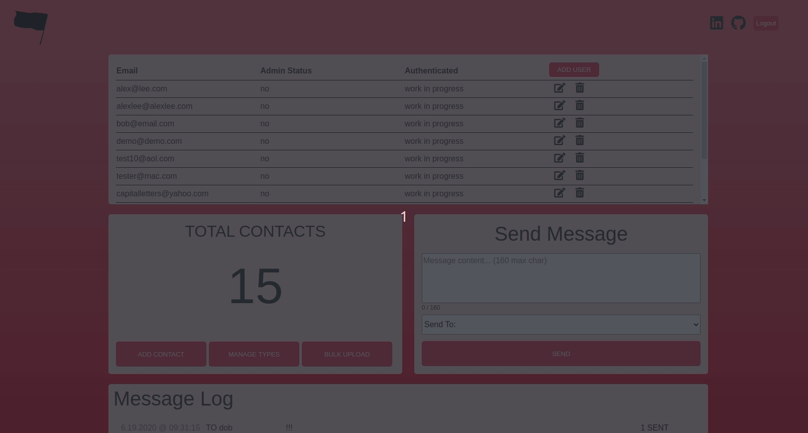
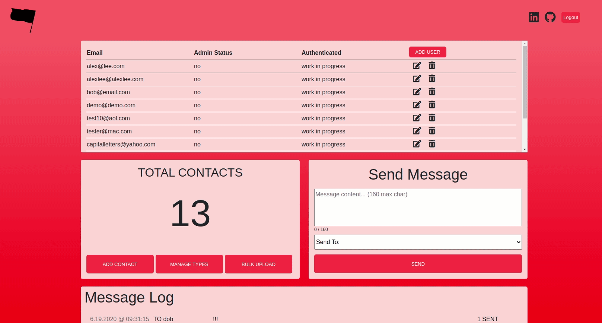
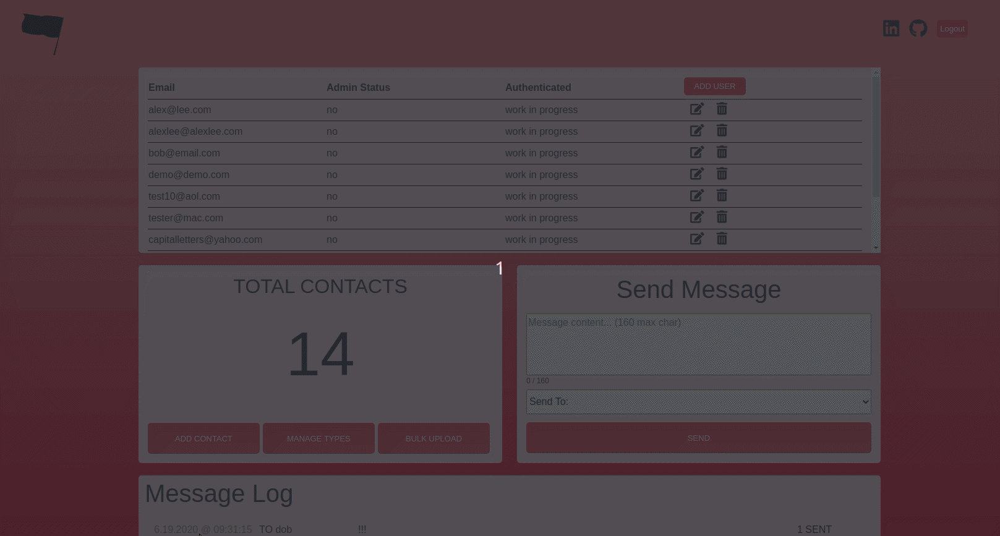
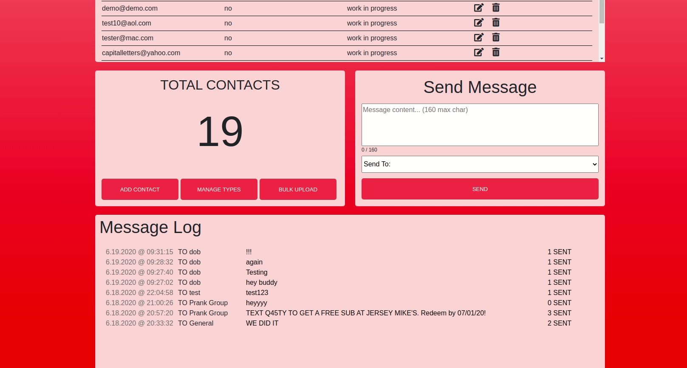

## Background and Overview  
[FTP](https://ftp-crm.herokuapp.com/) is a lightweight CRM tool for protest organizers to communicate with fellow activists through SMS messages.  
Admins have the ability to log-in via Desktop to add organizers who have access to the Mobile app. These organizer users can specify contacts as specific roles or groups in order to send more relevant messages. For example, users could send out important, “medical assistance requested” text only for contacts that have been designated as medics or a simple reminder message of an upcoming march to all members.  

#

## Technologies Used
* MongoDB
* Express.js
* React/Redux
* Node.js
* Twilio

#

## Functionality and MVP  
* Auth  
  * Users can sign up, log in, and log out

* Contact Type
  * Create contact types to categorize contacts

* Contacts
  * Add individual contacts or bulk upload using a CSV file

* Send Mass Text Messages (SMS)
  * Utilizing Twilio API
  * Send text messages to specific contact types

* BONUS: mobile app

#

### Desktop Admin Portal

#

### Mobile App for Organizers

#

## Technologies & Technical Challenges  
FTP’s core challenge is storing our contacts in a secure manner. Our architecture relies on a cipher stored in the production environment to encrypt and decrypt contact phone numbers. No other metadata is compiled for contacts, inherently mitigating the risks of a data breach.  
### Encrypted Contacts  
All of the contacts will be encrypted on the database and stored only as phone numbers. The cypher is stored in a hidden file within the environment. Users on the mobile app will not get contacts from the database, only dispatch a request to send a message to a given type of contact.  
### Uploading Contacts  
Admins can upload a CSV of phone numbers to add to the DB. This will be parsed and posted to the database.
### SMS Gateway  
We plan to implement the Twilio SMS gateway API for starters. It’s easy to use and also has a number of powerful features for organizations that wish to customize FTP. Contact phone numbers will be decrypted and dispatched through Twilio, but the unencrypted phone numbers will not persist within our database.
### React & React Native  
Admins login to our application through the desktop app built in react, while users login using a mobile app built in React Native. There is not much overlap between the two so we will have to build out two more or less independent front ends.

#

## Group Members & Work Breakdown
* Team Lead - Jonathan Yaniv
* Frontend Lead - William Suh
* Backend Lead - Alex Lee
* Flex - Adrian Kim
### Day 1 - June 15th
* Backend user auth (Alex)
* Backend messages (Adrian)
* Twilio webhooks (Jonathan)
* Frontend user auth (William)
  * Splash page
  * Login/signup form
### Day 2 - June 16th
* Backend contacts (Alex)
* frontend messages (Adrian)
  * Send message form
  * Message log
* Encrypting contacts (Jonathan)
* Frontend splash/login/signup (William)
### Day 3 - June 17th
* Frontend contacts (William)
  * Create single contact
  * Upload bulk contacts
* Backend for contact types (Alex)
* Frontend for contact types (Adrian)
  * Drop down contact type selector
  * Manage contact types form
* Parsing contact csv (Jonathan)
### Day 4 - June 18th
* Production README
* Refine CSS
* Finish testing & debugging

BONUS FEATURES:
* Mobile app
* Two step user auth
